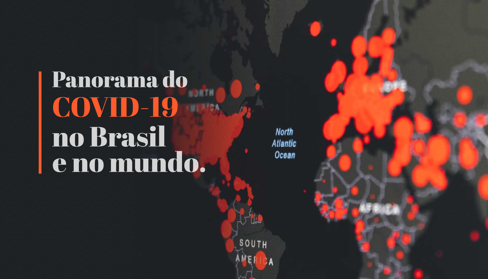

# Panorama do COVID-19 no Brasil e no mundo
TAGS: Análise Exploratória de Dados; Mineração de Dados; Redução de Dimensionalidade; Visualização de Dados; Filtragem de Dados; Seleção de Atributos

  

Neste projeto, analisei o panorama da pandemia do COVID-19 no Brasil e no mundo. Para isto, usei o dataset fornecido pelo *Our World in Data*, que é atualizado diariamente com dados sobre casos, mortes, vacinações, hospitalizações, além de dados populacionais e socioeconômicos.

O dataset pode ser encontrado nesse link: https://github.com/owid/covid-19-data/tree/master/public/data

### Os objetivos desse projeto foram:

- Identificar como aconteceu a evolução da COVID-19 ao redor do mundo, observando o crescimento dos casos e das mortes

- Avaliar os números mais recentes de casos e mortes e quais países lideram esse ranking.

- Entender a evolução e o impacto da vacinação no número de casos confirmados e nas mortes atribuídas à doença;

- Obter um panorama de como a doença se desenvolveu no Brasil.

## Link para o projeto:

Para acessar o notebook completo, basta seguir o link: https://github.com/gabrielrflopes/covid_project/blob/main/Panorama_do_COVID_19_no_Brasil_e_no_mundo.ipynb

## Artigo completo no Medium:

Para acessar o artigo, [clique aqui](https://medium.com/@grflopes/panorama-do-covid-19-no-brasil-e-no-mundo-a67cfb94af5f).
